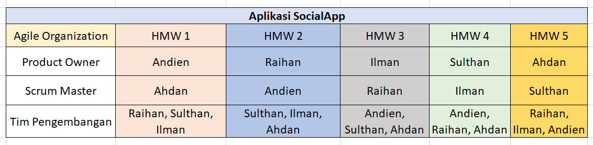

1. Nama Aplikasi : SocialApp 

2. Deskripsi Aplikasi : SocialApp adalah platform media sosial modern yang dirancang untuk menghubungkan orang-orang dari berbagai kalangan dalam satu ekosistem digital yang intuitif dan user-friendly. Terinspirasi dari konsep microblogging seperti Twitter/X, SocialApp memungkinkan pengguna untuk berbagi pemikiran, ide, dan momen dalam kehidupan mereka secara real-time. Dengan fitur utama Focs-C (Focus Content) adalah fitur inovatif yang membedakan SocialApp dari platform media sosial lainnya. Mode ini dirancang khusus untuk pengguna yang ingin tetap terhubung namun membutuhkan waktu fokus tanpa gangguan. 

3. Kelas-NIM-Nama :
 D-202210370311230-Sulthan Ariq Athallah-SulthanRiq
 D-202210370311232-Andien Tasya Belva Yoladra-andientasya
 D-202210370311245-Raihan Rahmadi Rahman-raihanrr11
 A-202210370311235-Ilman Nafian-ilman011004
 A-202210370311456-Muhammad Ahdan Fauzan-MuhamadAhdanfauzan
 
4. Link Figma : https://www.figma.com/design/qAtSu5qZhVxmbu4ABWaPCU/Rekayasa-Interaksi---Social-Media?node-id=140-4966&p=f&t=vdDHKttzuhbggJ9j-0 
 
5. Worksheet : 

6. Low Fidelity Prototype :  
 
7. Tabel pembagian BackLog : 
 
